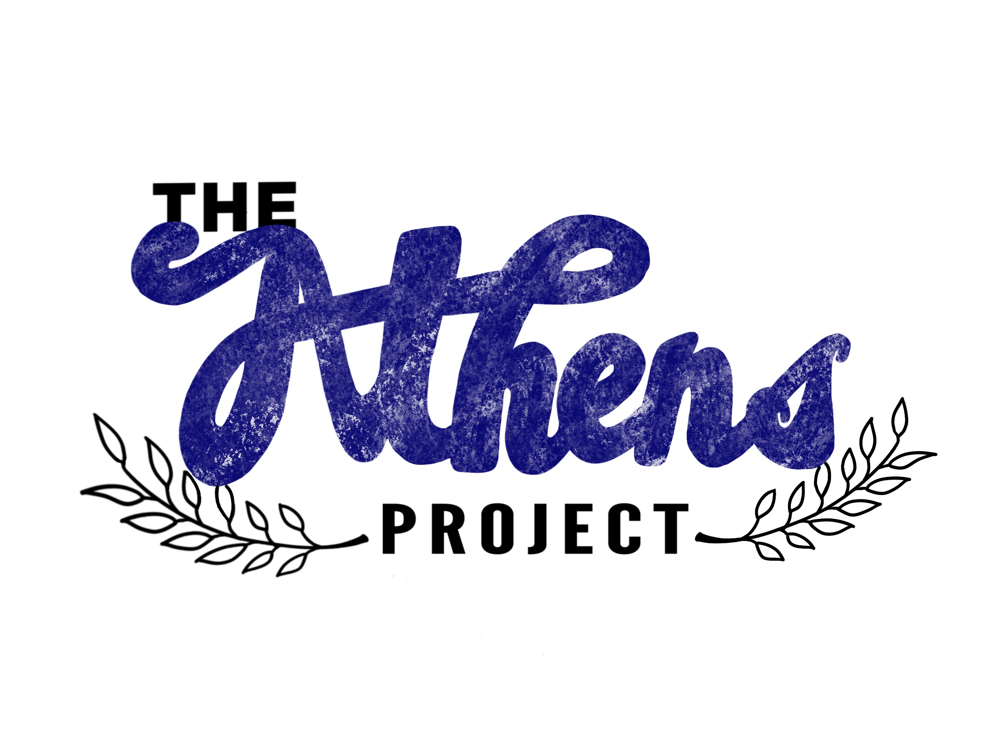

# Building An App with Go Modules and Athens :tada:

Hey Gophers! We're gonna build an awesome webapp with [Gin](https://github.com/gin-gonic/gin). Well, it's pretty basic but it shows cat and dog pictures so it's still pretty awesome :grinning:.

The cool part though? Instead of pulling all my webapp's dependencies directly from version control systems like GitHub (which we've always been doing in the past), we're gonna build it using module proxies and [Athens](https://docs.gomods.io).

In fact, we're actually gonna do the build in two different ways! We'll talk about each as we go. I developed and tested this demo on a Zsh shell on MacOS.

>I gave this demo at [GopherCon USA 2019](https://www.gophercon.com/agenda) in the session titled "The Athens Project - A Proxy Server for Go Modules".



# About the Web App

The web application we're going to build is fairly simple, but not trivial. I built a little server using [gin](https://github.com/gin-gonic/gin) as the framework, and it shows some HTML pages with cat pictures on them.

The cool thing is that the whole codebase is modules-aware. That means it has a `go.mod` file that keeps track of all my code's dependencies. The built-in [Go Modules](https://github.com/golang/go/wiki/Modules) system reads that file to look up the dependencies it needs to download before it builds my server.

# Run The Demo

Below is how how to do the demo yourself. The instructions are for Linux/Mac OS X systems.

## First Way: Build With Athens and an Upstream VCS

Athens starts up initially with nothing in its storage. When you run `go get`, it downloads modules from an "upstream". In this demo, we're configuring it to fetch code directly from the VCS, and then store it forever. You can also configure it to download from module mirrors like proxy.golang.org or gocenter.io.

### Run The Server!

We try hard to make it easy to run your own Athens. See [here](https://docs.gomods.io/install) for instructions for running the server a few different ways. Today, we're going to use [Docker](https://www.docker.com/) to run ours.

First, run this to start Athens up:

```console
$ docker run -p 3000:3000 -e GO_ENV=development gomods/athens:v0.5.0
```

And then to set your `GOPROXY` environment variable to tell modules to use the local server:

```console
$ export GOPROXY=http://localhost:3000
```

Also don't forget to clear your on-disk module cache:

```console
$ sudo rm -rf $(go env GOPATH)/pkg/mod
```

And then build and run the server!

```console
$ go run .
```

## Second Way: Use Your Athens While Offline :scream:

Like I mentioned in the last demo, Athens stores the dependencies you use _forever_ in its own storage. That means that you can build your code without access to the internet. Let's do that here!

First, make sure not to shut down the Athens server from last time - its storage is inside the Docker container!

Next, clear out your cache again:

```console
$ sudo rm -rf $(go env GOPATH)/pkg/mod
```

And then, **shut down your internet connection** :see_no_evil:.

And finally, do the build & run again!

```console
$ go run .
```

And you're done!

## Finally

Thanks for following along! Now you're both a Gopher _and_ an Athenian :green_heart:.

If you want to learn more, check out [docs.gomods.io](https://docs.gomods.io)! We'd also love for you to get involved - here are some ways to do so:

- Come star [our repo](https://github.com/gomods/athens)
- Come say hello on the `#athens` channel in the [Gophers Slack](https://invite.slack.golangbridge.org/)
  - This is a great place to come ask for help getting started and ask questions too :smile:
- And of course, file [bug reports](https://github.com/gomods/athens/issues/new/choose) or [feature requests](https://github.com/gomods/athens/issues/new/choose) and [contribute code](https://docs.gomods.io/contributing/new/development/)!

# Keep on rockin', Gophers!


